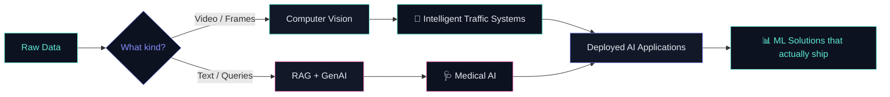

<div align="center">



</div>

<br/>

### `// 01. about`

I'm Juhi — an **AI/ML developer in the making**, building systems that don't just process data but *make sense of it*: reading a traffic frame and deciding what happens next, reading a medical query and grounding it in real context instead of guessing.

I like problems where the model has to be right, not just impressive — that's what pulls me toward **computer vision** and **retrieval-grounded GenAI** instead of chasing whatever's trending.

<br/>

### `// 02. what i build`



<br/>

### `// 03. featured projects`

<div align="center">

<a href="https://github.com/Juhi2611/Spark-Odoo-2026">

</a>
<a href="https://github.com/Juhi2611/FinalTeamUp">

</a>

<br/>

<a href="https://github.com/Juhi2611/bff">

</a>
<a href="https://github.com/Juhi2611/Eye-Cursor-Using-Python">

</a>

</div>

<br/>

### `// 04. live deployments`

<table>
<tr>
<td width="25%" align="center">🥶<br/><b>BFF</b><br/><sub>Bharat Freeze Dry Foods — export-grade cold-chain business site</sub><br/><a href="https://bff-alpha-five.vercel.app/">Live →</a></td>
<td width="25%" align="center">🧑‍💻<br/><b>Portfolio</b><br/><sub>personal portfolio — projects, skills, education</sub><br/><a href="https://juhi-vanjara-interactive-portfolio-theta.vercel.app/">Live →</a></td>
<td width="25%" align="center">🔍<br/><b>LinguaLens</b><br/><sub>AI tool that analyzes, translates &amp; gives deep insight into text across languages</sub><br/><a href="https://lingualens-three.vercel.app/">Live →</a></td>
<td width="25%" align="center">🧴<br/><b>Skinn Care</b><br/><sub>skincare brand landing page with interactive UI</sub><br/><a href="https://skinn-care-a4c8.vercel.app/">Live →</a></td>
</tr>
</table>

<br/>

### `// 05. what pulls my attention`

<table>
<tr>
<td width="25%" align="center">👁️<br/><b>Computer Vision</b><br/><sub>frame-by-frame decisions in real time — traffic flow, congestion, signal timing</sub></td>
<td width="25%" align="center">🩺<br/><b>Medical AI</b><br/><sub>grounding model answers in real medical context instead of guessing</sub></td>
<td width="25%" align="center">🔎<br/><b>RAG</b><br/><sub>retrieval that makes generation trustworthy, not just fluent</sub></td>
<td width="25%" align="center">🤖<br/><b>AI Agents</b><br/><sub>systems that plan, act, and correct themselves</sub></td>
</tr>
</table>

<br/>

### `// 06. currently training on`

```
[■■■■■■■■□□] Machine Learning
[■■■■■□□□□□] Generative AI
[■■■□□□□□□□] RAG
[■■□□□□□□□□] AI Agents
```
<sub>self-reported, updated as I go — not a leaderboard, just a log</sub>

<br/>

### `// 07. stack`

<div align="center">


<br/><br/>


</div>

<br/>

### `// 08. contributions`

<div align="center">

<sub><code>juhi@github ~ $ git log --stat --author=Juhi2611 --since="1 year ago"</code></sub>


<br/><br/>

<sub><code>juhi@github ~ $ ls --lang --by-bytes | sort -r</code></sub>


<br/><br/>

<sub><code>juhi@github ~ $ tail -f contribution_graph.log</code></sub>


</div>

<br/>

### `// 09. connect`

<div align="center">


<br/><br/>


</div>

<div align="center">
<sub>// end of profile.py — thanks for reading the source</sub>
</div>
